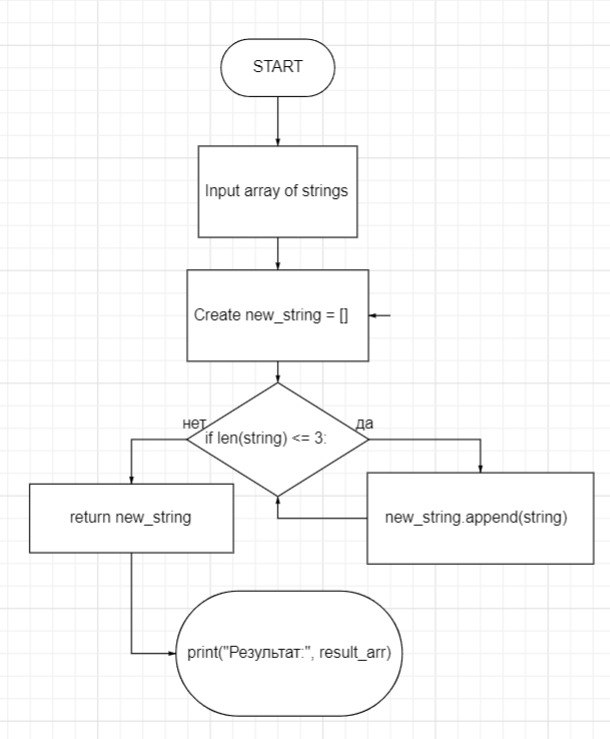

# Программа для фильтрации строк

Программа принимает массив строк и формирует новый массив, содержащий только строки длиной меньше или равной 3 символам. Решение реализовано с использованием только массивов.

## Использование

1. Установите Python, если его еще нет на вашей системе.

2. Склонируйте репозиторий или скачайте файл main.py из этого репозитория.

3. Запустите программу, выполнив команду:

4. Введите массив строк через запятую и нажмите Enter.

5. Программа выведет отфильтрованный массив строк.

## Примеры

Примеры использования программы:

- Ввод: `Hello,2,world,:-)`

  Вывод: `['2', ':-)']`

- Ввод: `1234,1567,-2,computer science`

  Вывод: `['-2']`

- Ввод: `Russia,Denmark,Kazan`

  Вывод: `[]`

## Блок-схема программы

